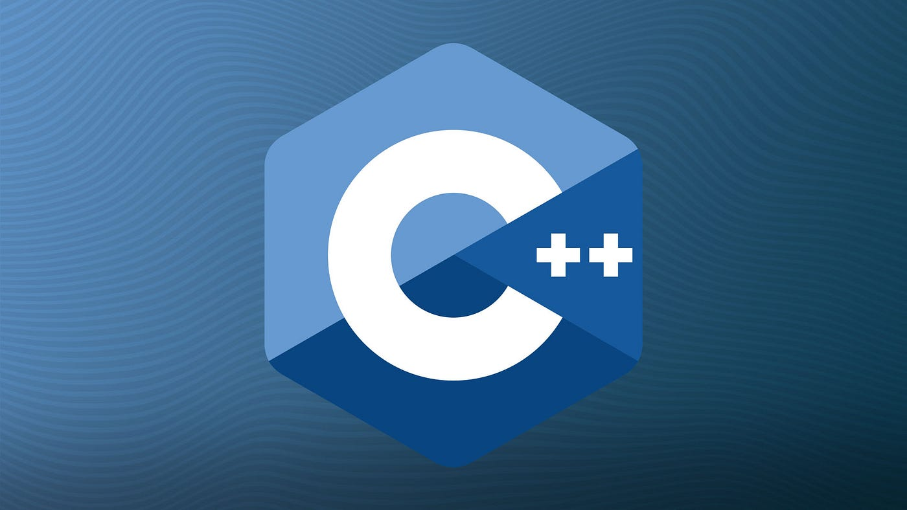
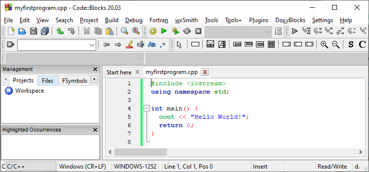
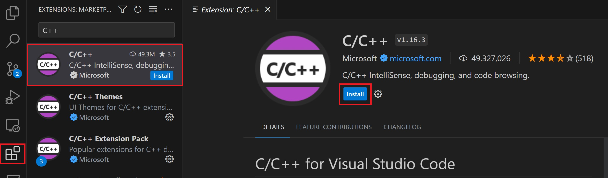
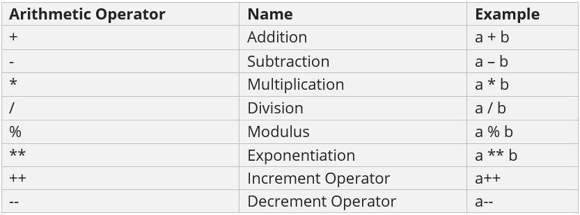
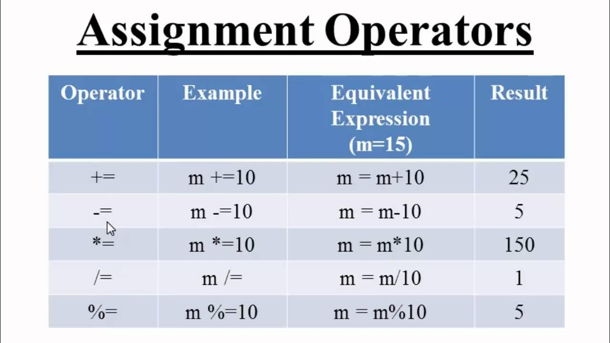
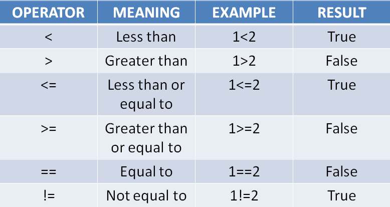
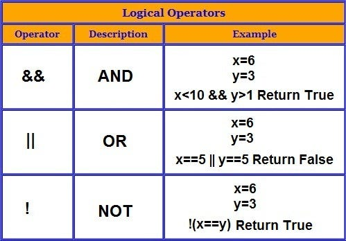

# Table Of Contents
 1. [Introduction](#1-introduction)

 2. [Installation](#2-installation)

 3. [Variables](#3-variables)

 4. [Operators](#4-operators)

 5. [Switch statement](#5-switch-statement)

 6. [Loop](#6-loop)

 7. [Comments](#7-comments)

 8. [List](#8-list)

 9. [References](#9-references)

# 1. Introduction
### C++ is a cross-platform language that can be used to create high-performance applications.

### C++ was developed by Bjarne Stroustrup, as an extension to the C language.

### C++ gives programmers a high level of control over system resources and memory.

### The language was updated 4 major times in 2011, 2014, 2017, and 2020 to C++11, C++14, C++17, C++20

## Why Use C++

### C++ is one of the world's most popular programming languages.

### C++ can be found in today's operating systems, Graphical User Interfaces, and embedded systems.

### C++ is an object-oriented programming language which gives a clear structure to programs and allows code to be reused, lowering development costs.

### C++ is portable and can be used to develop applications that can be adapted to multiple platforms.

### C++ is fun and easy to learn!

### As C++ is close to C, C# and Java, it makes it easy for programmers to switch to C++ or vice versa.
### Example:-

### Output:-
```
Hello World!
Process returned 0 (0x0) execution time : 0.011 s
Press any key to continue.
```

### Example explained
### Line 1: #include <iostream> is a header file library that lets us work with input and output objects, such as cout (used in line 5). Header files add functionality to C++ programs.
### Line 2: using namespace std means that we can use names for objects and variables from the standard library.
### Line 3: A blank line. C++ ignores white space. But we use it to make the code more readable.

### Line 4: Another thing that always appear in a C++ program is int main(). This is called a function. Any code inside its curly brackets {} will be executed.

### Line 5: cout (pronounced "see-out") is an object used together with the insertion operator (<<) to output/print text. In our example, it will output "Hello World!".
### Line 6: return 0; ends the main function.

# 2. Installation
### >Open VS Code.
### >Select the Extensions view icon on the Activity bar or use the keyboard shortcut (Ctrl+Shift+X).
### >Search for 'C++'.
### >Select Install.

# 3. Variables 
### Variables are containers for storing data values.

### In C++, there are different types of variables (defined with different keywords), for example:

 #### int - stores integers (whole numbers), without decimals, such as 123 or -123
 ```

Create a variable called myNum of type int and assign it the value 15:

int myNum = 15;
cout << myNum;
```
#### double - stores floating point numbers, with decimals, such as 19.99 or -19.99
```
double myFloatNum = 5.99;    // Floating point number (with decimals)
```
#### char - stores single characters, such as 'a' or 'B'. Char values are surrounded by single quotes
```
char myLetter = 'D';         // Character
```
#### string - stores text, such as "Hello World". String values are surrounded by double quotes
```

string myText = "Hello";     // String (text)
```
#### bool - stores values with two states: true or false
```
bool myBoolean = true;       // Boolean (true or false)
```
# 4. Operators 
## Operators are used to perform operations on variables and values.
## C++ divides the operators into the following groups:

### 1. Arithmetic operators
#### Arithmetic operators are used to perform common mathematical operations.


### 2. Assignment operators
#### Assignment operators are used to assign values to variables.


### 3. Comparison operators
#### Comparison operators are used to compare two values (or variables). This is important in programming, because it helps us to find answers and make decisions.

### Example:-
```
int x = 5;
int y = 3;
cout << (x > y); // returns 1 (true) because 5 is greater than 3
```
### 4.Logical operators
#### Logical operators are used to determine the logic between variables or values:


# 5. Switch statement
### Use the switch statement to select one of many code blocks to be executed.

### Syntax:-
```
switch(expression) {
  case x:
    // code block
    break;
  case y:
    // code block
    break;
  default:
    // code block
}
```
### This is how it works:

#### The switch expression is evaluated once
#### The value of the expression is compared with the values of each case
#### If there is a match, the associated block of code is executed
#### The ``break`` and ``default``keywords are optional, and will be described later in this chapter


### Example:-
```
int day = 4;
switch (day) {
  case 1:
    cout << "Monday";
    break;
  case 2:
    cout << "Tuesday";
    break;
  case 3:
    cout << "Wednesday";
    break;
  case 4:
    cout << "Thursday";
    break;
  case 5:
    cout << "Friday";
    break;
  case 6:
    cout << "Saturday";
    break;
  case 7:
    cout << "Sunday";
    break;
}
```
### Output:-
```
 "Thursday" (day 4)

```
# 6. Loop
### Loops can execute a block of code as long as a specified condition is reached.

### Loops are handy because they save time, reduce errors, and they make code more readable.

## 1. While Loop
### The ``while``loop loops through a block of code as long as a specified condition is ``true``:
### Syntax:-
```
while (condition) {
  // code block to be executed
}
```
### In the example below, the code in the loop will run, over and over again, as long as a variable ``(i)`` is less than 5:
### Example:-
```
int i = 0;
while (i < 5) {
  cout << i << "\n";
  i++;
}
```
### Output:-
```
0
1
2
3
4
```
## 2. Do/While Loop
### The ``do/while`` loop is a variant of the ``while`` loop. This loop will execute the code block once, before checking if the condition is true, then it will repeat the loop as long as the condition is true.
### Syntax
```
do {
  // code block to be executed
}
while (condition);
```
### Example:-
```
int i = 0;
do {
  cout << i << "\n";
  i++;
}
while (i < 5);
```
### Output:-
```
0
1
2
3
4
```
## 3. For Loop
### When you know exactly how many times you want to loop through a block of code, use the for loop instead of a while loop:
### Syntax
```
for (statement 1; statement 2; statement 3) {
  // code block to be executed
}
```
###  Example:-
```
for (int i = 0; i < 5; i++) {
  cout << i << "\n";
}
```
### Output:-
```
0
1
2
3
4
```
## 4. Nested Loop 
 ### It is also possible to place a loop inside another loop. This is called a nested loop.

 ### The "inner loop" will be executed one time for each iteration of the "outer loop":
### Example
```
// Outer loop
for (int i = 1; i <= 2; ++i) {
  cout << "Outer: " << i << "\n"; // Executes 2 times

  // Inner loop
  for (int j = 1; j <= 3; ++j) {
    cout << " Inner: " << j << "\n"; // Executes 6 times (2 * 3)
  }
}
```
### Output:-
```
Outer: 1
 Inner: 1
 Inner: 2
 Inner: 3
Outer: 2
 Inner: 1
 Inner: 2
 Inner: 3
```
# 7. Comments 
### Comments can be used to explain C++ code, and to make it more readable. It can also be used to prevent execution when testing alternative code. Comments can be singled-lined or multi-lined.
## 1. Single-line Comments
### Single-line comments start with two forward slashes (//).

### Any text between // and the end of the line is ignored by the compiler (will not be executed).

### This example uses a single-line comment before a line of code:
### Example:-
```
// This is a comment
cout << "Hello World!";
```
### output:-
```
Hello World!
```
## 2. Multi-line Comments
### Multi-line comments start with /* and ends with */.

### Any text between /* and */ will be ignored by the compiler:
### Example:-
```
/* The code below will print the words Hello World!
to the screen, and it is amazing */
cout << "Hello World!";
```
### Output:-
```
Hello World!
```
# 8. List 
## To create a list, use the list keyword, and specify the type of values it should store within angle brackets <> and then the name of the list, like: list<type> listName.
### Example:-
```
// Create a list called cars that will store strings
list<string> cars = {"Volvo", "BMW", "Ford", "Mazda"};

// Print list elements
for (string car : cars) {
  cout << car << "\n";
}
```
Output:-
```
Volvo
BMW
Ford
Mazda
```
## >Loop Through a List
### You cannot loop through the list elements with a traditional for loop combined with the .size() function, since it is not possible to access elements in a list by index:
### Example:-
```
#include <iostream>
#include <list>
using namespace std;
 
int main()
{
    // defining list
    list<int> gqlist{12,45,8,6};
 
    for (auto i : gqlist) {
        cout << i << ' ';
    }
    return 0;
}
```
### Output:-
```
12 45 8 6
```

# 9. References
https://medium.com/@anushkasnawale/create-website-using-c-3c06d3381a17
https://www.w3schools.com/cpp/default.asp
https://www.geeksforgeeks.org/list-cpp-stl/

